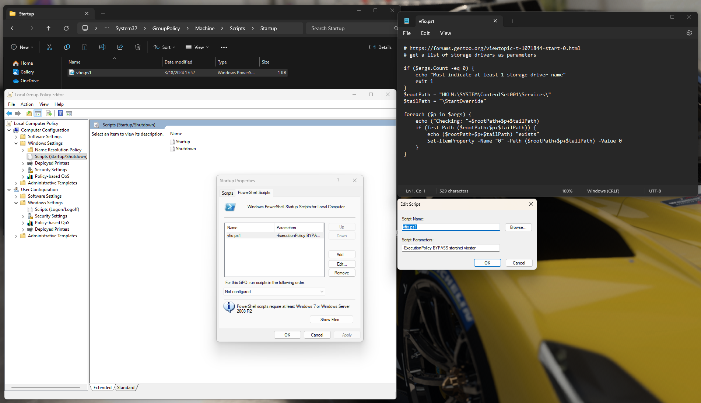

# VFIO VM Setup

## Goal
Create a Virtual Machine that has exclusive control over a GPU.

## Resources
Some helpful links:
- https://wiki.archlinux.org/title/PCI_passthrough_via_OVMF
- https://forums.gentoo.org/viewtopic-t-1071844-start-0.html
  - https://web.archive.org/web/20240420015927/https://forums.gentoo.org/viewtopic-t-1071844-start-0.html
  - https://linkwarden.landrevj.dev/preserved/13?format=2
- https://astrid.tech/2022/09/22/0/nixos-gpu-vfio/
  - https://web.archive.org/web/20240326195357/https://astrid.tech/2022/09/22/0/nixos-gpu-vfio/
- https://forum.level1techs.com/t/nixos-vfio-pcie-passthrough/130916

## Steps

## Issues

### Windows VM fails to boot after being booted into natively
One of the biggest blockers I ran into was the Win11 VM would work without issues up until I booted into that drive normally (i.e. not as a VM) and then try to boot it as a VM again. This would cause it to no longer boot properly. I believe the issue is that when you boot windows normally it marks the virtio disk driver as non-essential and it doesn't get loaded at boot when you try to use it as a VM again.

#### Solution
The solution is described in this [gentoo forum post](https://forums.gentoo.org/viewtopic-t-1071844-start-0.html) which sets up a powershell script to tell windows to load that driver during the next boot.

Create some `vfio.ps1` file at `C:\Windows\System32\GroupPolicy\Machine\Scripts\Startup` with the contents:
```ps1
if ($args.Count -eq 0) {
    echo "Must indicate at least 1 storage driver name"
    exit 1
}
$rootPath = "HKLM:\SYSTEM\ControlSet001\Services\"
$tailPath = "\StartOverride"

foreach ($p in $args) {
    echo ("Checking: "+$rootPath+$p+$tailPath)
    if (Test-Path ($rootPath+$p+$tailPath)) {
        echo ($rootPath+$p+$tailPath) "exists"
        Set-ItemProperty -Name "0" -Path ($rootPath+$p+$tailPath) -Value 0
    }
}
```
We then want to launch `gpedit.msc` and add the script in `Computer Configuration -> Windows Settings -> Scripts -> Startup`. In the script parameters input we want to pass it the following (the `storachi viostor` part will change depending on which driver(s) you want to ensure load):
```ps1
-ExecutionPolicy BYPASS storahci viostor
```
Here is a very busy screenshot showing everything:


### VM randomly stopped having network access
At some point I booted the Win11 VM and it didn't have internet access. It *did* show a
working ethernet device and `ipconfig` showed it had an IP address.

Some searching led me to this [stackoverflow answer](https://superuser.com/a/1725346) which resolved things. We just need to make sure the VM uses our actual ethernet device.

#### Solution
Run `route` and note the default interface's name, `enp9s0` in this case:
```shell
❯ route
Kernel IP routing table
Destination     Gateway         Genmask         Flags Metric Ref    Use Iface
default         _gateway        0.0.0.0         UG    100    0        0 enp9s0
192.168.50.0    0.0.0.0         255.255.255.0   U     100    0        0 enp9s0
192.168.100.0   0.0.0.0         255.255.255.0   U     0      0        0 virbr1
...
```

Add a new virtual network in `virt-manager`/`libvirt` (basically default options, just "Forward to: Physical device..." and "Device: enp9s0"):
```xml
<network>
  <name>enp9s0</name>
  <uuid>9132c0bf-a288-4469-acb5-74a77ccfd08c</uuid>
  <forward dev="enp9s0" mode="nat">
    <nat>
      <port start="1024" end="65535"/>
    </nat>
    <interface dev="enp9s0"/>
  </forward>
  <bridge name="virbr1" stp="on" delay="0"/>
  <mac address="**:**:**:**:**:**"/>
  <domain name="enp9s0"/>
  <ip address="192.168.100.1" netmask="255.255.255.0">
    <dhcp>
      <range start="192.168.100.128" end="192.168.100.254"/>
    </dhcp>
  </ip>
</network>
```
Then set the vm to use that new interface (NIC -> Network Source -> the one we just made):
```xml
<interface type="network">
  <mac address="**:**:**:**:**:**"/>
  <source network="enp9s0"/>
  <model type="e*****"/>
  <address type="pci" domain="0x0000" bus="0x01" slot="0x00" function="0x0"/>
</interface>
```

### VM won't boot more than once per host boot
For me this was due to the PCIe usb card I was passing to the VM not supporting PCIe reset properly.
This meant the card didn't get reset when the VM shut off and would throw errors when you'd try to
start the VM again.

#### Solution
Cards with the Fresco Logic chips can be a bit iffy, but I remember reading somewhere that the ones with the Renesas UPD720201/UPD720210 chip
should work just fine. The [one I bought](https://www.amazon.com/dp/B081Y4NT25) does at least.